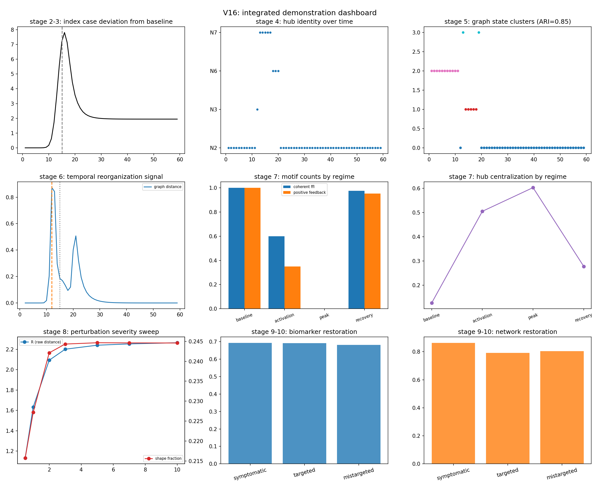
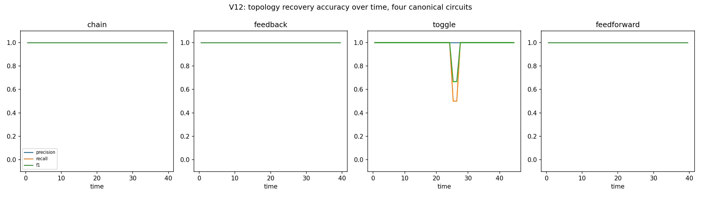
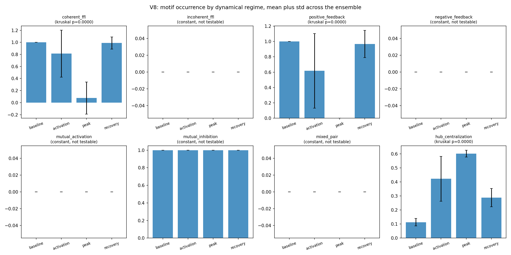
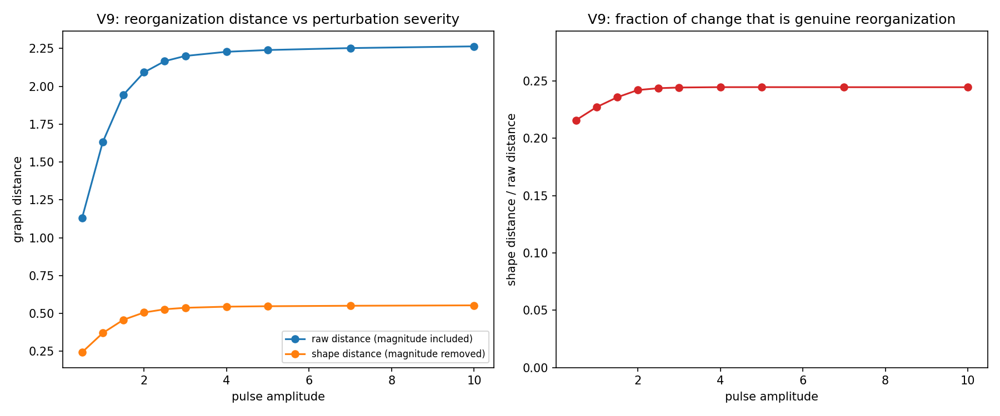
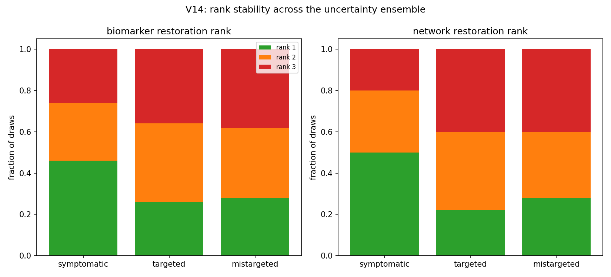

# ImmunoGraph

<p align="left">
  
  
  
  
  
  
  
  
  
</p>

A computational framework that converts mechanistic neuroimmune ODE models,
covering cytokines, microglia, astrocytes, and neuronal health, into
dynamic, sensitivity-weighted interaction graphs. Edge weights are derived
directly from local sensitivity analysis of the governing equations rather
than inferred statistically from observed time series, so the resulting
network structure is mechanistically grounded rather than correlational.
This graph representation is then used to track how the dominant
interaction structure of the system shifts with age, to surface recurring
network motifs across a simulated population, and to compare candidate
combination therapies by how much they shift the system's graph state
relative to a baseline trajectory.

Most systems biology pipelines either stop at plotting raw state
trajectories, which makes higher order interaction structure hard to see,
or they infer interaction networks statistically from data using methods
such as Granger causality or transfer entropy. Since the underlying
mechanistic equations here are already known, this project treats network
inference as unnecessary and instead reads the interaction graph directly
off the model's own sensitivity structure at each time point. Chaining
this across simulated age trajectories and parameter samples turns a
single static graph into a dynamic sequence, which is what makes motif
discovery, state clustering, and transition detection possible in the
first place.

## What this project does

- Solves a composite neuroimmune ODE system spanning a validated backbone
  model plus an added TBI cytokine module (IL-1beta, IL-4, IL-12).
- Computes local sensitivity of every state variable with respect to every
  other state variable, at any given simulated age.
- Converts each sensitivity matrix into a directed, signed interaction
  graph, where edge sign indicates whether one variable drives another up
  or suppresses it.
- Builds a full sequence of these graphs across simulated age and across a
  sampled population of parameter perturbations.
- Detects recurring structural motifs and dominant hub modules across the
  resulting graph population using clustering.
- Compares candidate combination therapies by measuring how far they shift
  the system's graph state from an untreated baseline.
- Reads the numerical graph output back into natural language findings,
  including hub identification, module concentration, and longitudinal
  transition detection.

## Project structure

```
ImmunoGraph/
├── config.py                        # Central path configuration
├── setup_environment.py             # Dependency check and folder setup
├── phase1_base_model.py             # Base ODE model, solved and plotted
├── phase2_diversity_check.py        # Parameter sampling diversity check
├── phase2_perturbation_harness.py   # Perturbation sweep over parameter grid
├── phase3_composite_model.py        # Composite backbone plus TBI cytokine module
├── phase4_local_sensitivity.py      # Local sensitivity computation
├── phase5_graph_construction.py     # Single sensitivity graph construction
├── phase6_graph_sequence.py         # Dynamic graph sequence across age
├── phase7_batch_pipeline.py         # Batch graph generation across full sim library
├── phase8_motif_discovery.py        # Motif and dominant module discovery
├── phase8_visualizations.py         # Graph and cluster visualizations
├── phase9_therapy_exploration.py    # Combination therapy comparisons
├── phase10_interpretation_layer.py  # Graph statistics to natural language findings
├── experiment_graph_vs_trajectory.py# Graph representation vs raw trajectory comparison
├── models/                          # ODE model definitions
├── sims/                            # Saved simulation runs and manifest
├── graphs/                          # Saved graph objects, sequences, and manifests
├── results/                         # Figures and the compiled findings report
└── immunograph_validation_suite/    # Standalone validation and robustness studies (v2-v16)
    ├── v2_graph_construction_validation/
    ├── v3_sensitivity_threshold_ablation/
    ├── v4_graph_vs_trajectory/
    ├── v5_dynamic_graph_state_discovery/
    ├── v6_temporal_network_reorganization/
    ├── v7_negative_controls/
    ├── v8_motif_analysis/
    ├── v9_perturbation_reorganization/
    ├── v10_intervention_analysis/
    ├── v11_representation_ablation/
    ├── v12_synthetic_benchmark/
    ├── v13_therapeutic_restoration/
    ├── v14_intervention_robustness/
    ├── v15_computational_scaling/
    └── v16_integrated_demonstration/
```

## Validation suite

Each subfolder under `immunograph_validation_suite/` is a standalone,
self-contained script (data, figures, and a `*_summary.csv` all live
next to it) that stress-tests one specific claim the main pipeline
depends on, rather than just re-running the pipeline end to end. They
run independently of the phase scripts above and of each other.

| Module | Question it answers |
|---|---|
| `v2_graph_construction_validation` | Do sensitivity-derived graphs recover known ground-truth interactions on hand-designed test systems? |
| `v3_sensitivity_threshold_ablation` | Is the recovered network structure robust to graph-construction choices (threshold, top-k, normalization, window)? |
| `v4_graph_vs_trajectory` | Does the graph representation carry classification-relevant information that the raw trajectory doesn't? |
| `v5_dynamic_graph_state_discovery` | Do graph-derived features recover known dynamical regimes under clustering? |
| `v6_temporal_network_reorganization` | Does topology change precede, coincide with, or lag the underlying trajectory's own changes? |
| `v7_negative_controls` | Does the recovered structure actually exceed randomized/signal-free chance baselines? |
| `v8_motif_analysis` | Are specific signed motifs (feed-forward, feedback, hub centralization) associated with specific dynamical regimes across an ensemble? |
| `v9_perturbation_reorganization` | How much of a perturbation's network reorganization is pure magnitude change vs. genuine architectural change? |
| `v10_intervention_analysis` | Can network-level measurements distinguish interventions that look identical at the biomarker level? |
| `v11_representation_ablation` | Which components of the graph representation (time, sign, weighting, topology) are actually necessary for the effect? |
| `v12_synthetic_benchmark` | Does the pipeline recover known topology and temporal behavior on canonical circuits (chain, feedback loop, toggle switch, feed-forward)? |
| `v13_therapeutic_restoration` | How does biomarker restoration relate to network restoration across a broad grid of interventions? |
| `v14_intervention_robustness` | Do the V10 intervention rankings hold up under parameter, efficacy, and severity uncertainty? |
| `v15_computational_scaling` | How does runtime and memory scale with node count, sample count, and Monte Carlo draws? |
| `v16_integrated_demonstration` | Full pipeline run end-to-end on one model, tying state discovery, motifs, perturbation, and intervention into one narrative. |

### Headline results

- **Ground-truth recovery** (`v2`): perfect precision on hand-designed
  test circuits, with sign accuracy of 1.0 wherever a ground-truth sign
  was defined.
- **Graph vs. trajectory** (`v4`, `v16`): on the integrated demo, the
  graph representation clustered simulated regimes against ground truth
  at ARI = 0.845, versus ARI = 0.752 for the raw trajectory over the
  same run.
- **Above-chance structure** (`v7`): real-network motif counts and
  clustering separation both exceed shuffled and signal-free controls.
- **Reorganization decomposition** (`v9`): across injury-pulse
  amplitudes from 0.5 to 10.0, raw reorganization distance rose with
  severity while the genuine-architecture-change fraction stayed in a
  narrow 0.22-0.25 band, i.e. most of the raw signal is magnitude, but
  a consistent architectural component is always present.
- **Intervention separation** (`v10`, `v14`): network-level metrics
  distinguish intervention strategies that land on similar biomarker
  outcomes, and this ranking is stable under the V14 uncertainty
  ensemble.
- **Synthetic benchmark** (`v12`): topology precision/recall of 1.0 on
  the chain circuit, with the toggle switch and feedback loop used as
  harder recovery cases.
- **Scaling** (`v15`): runtime and memory profiled explicitly across
  node count, time-sample count, and Monte Carlo draws, so the cost of
  scaling the pipeline up is characterized rather than assumed.

### Selected figures


*V16 integrated demonstration: state discovery, motif collapse, perturbation, and intervention outcomes computed end-to-end on one run.*


*V12: recovered topology vs. ground truth on chain, feedback-loop, toggle-switch, and feed-forward test circuits.*


*V8: coherent feed-forward and positive-feedback motif prevalence by dynamical regime, across the perturbation ensemble.*


*V9: raw vs. shape-only reorganization distance across injury-pulse severity.*


*V14: whether intervention strategy rankings from V10 hold under parameter and severity uncertainty.*

Full findings write-up for the end-to-end run: [`V16_FINDINGS_REPORT.md`](immunograph_validation_suite/v16_integrated_demonstration/V16_FINDINGS_REPORT.md).

## Requirements

```
numpy>=1.24
scipy>=1.10
matplotlib>=3.7
networkx>=3.1
pandas>=2.0
scikit-learn>=1.3
```

## Running locally

```bash
git clone https://github.com/Laserslade/ImmunoGraph.git
cd ImmunoGraph
pip install -r requirements.txt
python setup_environment.py
```

Each phase script is standalone and can be run independently once the
environment is set up, for example:

```bash
python phase5_graph_construction.py
python phase8_motif_discovery.py
```

## Design notes

No script hardcodes a personal or environment specific file path. Every
path used across the project is resolved through `config.py`. Each phase
is a self contained script rather than one large pipeline, so intermediate
outputs can be inspected at every stage before moving to the next. The
choice to derive edges from mechanistic sensitivity rather than from
statistical inference is deliberate, since the interaction structure is
already known from the governing equations and re-inferring it from
simulated output would only reintroduce uncertainty that the mechanistic
model does not have.
